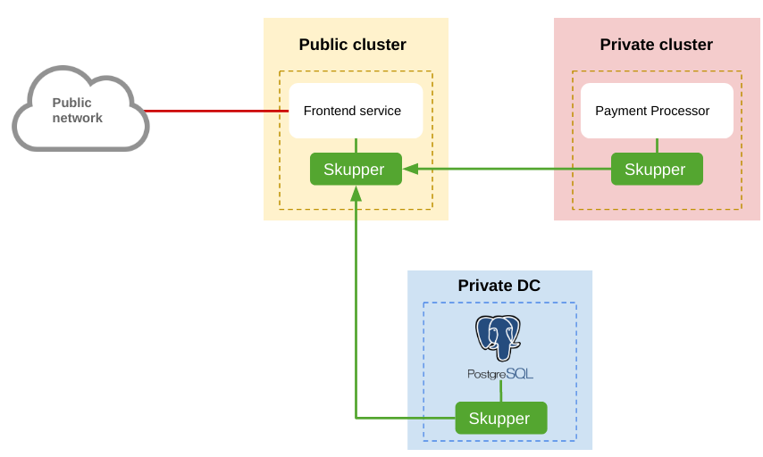
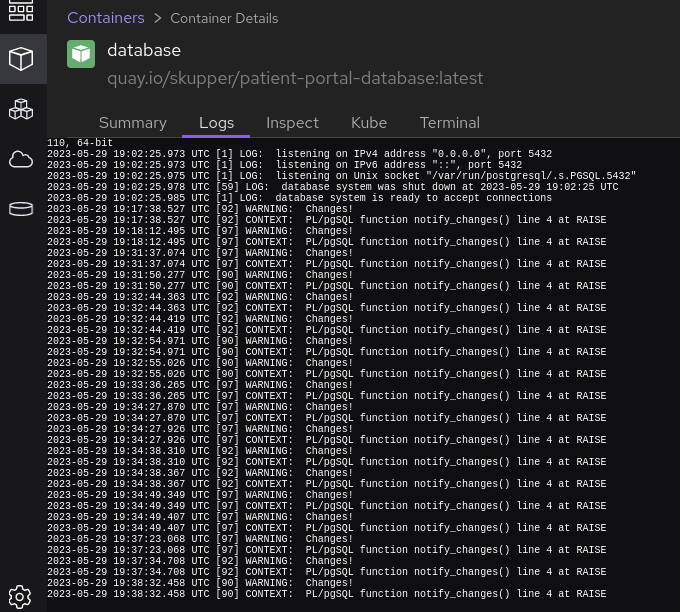
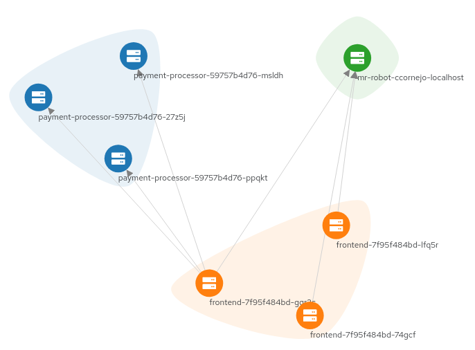

# Patient Portal

#### A simple database-backed web application that runs in the public cloud but keeps its data in a private database

This example is part of a [suite of examples][examples] showing the
different ways you can use [Skupper][website] to connect services
across cloud providers, data centers, and edge sites.

[website]: https://skupper.io/
[examples]: https://skupper.io/examples/index.html

#### Contents

* [Overview](#overview)
* [Prerequisites](#prerequisites)
* [Step 1: Install the Skupper command-line tool](#step-1-install-the-skupper-command-line-tool)
* [Step 2: Configure separate console sessions](#step-2-configure-separate-console-sessions)
* [Step 3: Access your clusters](#step-3-access-your-clusters)
* [Step 4: Set up your namespaces](#step-4-set-up-your-namespaces)
* [Step 5: Install Skupper in your namespaces](#step-5-install-skupper-in-your-namespaces)
* [Step 6: Check the status of your namespaces](#step-6-check-the-status-of-your-namespaces)
* [Step 7: Link your namespaces](#step-7-link-your-namespaces)
* [Step 8: Deploy and expose the database](#step-8-deploy-and-expose-the-database)
* [Step 9: Deploy and expose the payment processor](#step-9-deploy-and-expose-the-payment-processor)
* [Step 10: Deploy and expose the frontend](#step-10-deploy-and-expose-the-frontend)
* [Step 11: Test the application](#step-11-test-the-application)
* [Cleaning up](#cleaning-up)
* [About this example](#about-this-example)

## Overview

This example is a simple database-backed web application that shows
how you can use Skupper to access a database at a remote site
without exposing it to the public internet.

It contains three services:

  * A PostgreSQL database running on a bare-metal or virtual
    machine in a private data center.

  * A payment-processing service running on Kubernetes in a private
    data center.

  * A web frontend service running on Kubernetes in the public
    cloud.  It uses the PostgreSQL database and the
    payment-processing service.

This example uses two Kubernetes namespaces, "private" and "public",
to represent the private Kubernetes cluster and the public cloud.

## Prerequisites

* The `kubectl` command-line tool, version 1.15 or later
  ([installation guide][install-kubectl])

* Access to at least one Kubernetes cluster, from [any provider you
  choose][kube-providers]

[install-kubectl]: https://kubernetes.io/docs/tasks/tools/install-kubectl/
[kube-providers]: https://skupper.io/start/index.html#prerequisites

## Step 1: Install the Skupper command-line tool

The `skupper` command-line tool is the primary entrypoint for
installing and configuring the Skupper infrastructure.  You need
to install the `skupper` command only once for each development
environment.

On Linux or Mac, you can use the install script (inspect it
[here][install-script]) to download and extract the command:

~~~ shell
curl https://skupper.io/install.sh | sh
~~~

The script installs the command under your home directory.  It
prompts you to add the command to your path if necessary.

For Windows and other installation options, see [Installing
Skupper][install-docs].

[install-script]: https://github.com/skupperproject/skupper-website/blob/main/docs/install.sh
[install-docs]: https://skupper.io/install/index.html

## Step 2: Configure separate console sessions

Skupper is designed for use with multiple namespaces, usually on
different clusters.  The `skupper` command uses your
[kubeconfig][kubeconfig] and current context to select the
namespace where it operates.

[kubeconfig]: https://kubernetes.io/docs/concepts/configuration/organize-cluster-access-kubeconfig/

Your kubeconfig is stored in a file in your home directory.  The
`skupper` and `kubectl` commands use the `KUBECONFIG` environment
variable to locate it.

A single kubeconfig supports only one active context per user.
Since you will be using multiple contexts at once in this
exercise, you need to create distinct kubeconfigs.

Start a console session for each of your namespaces.  Set the
`KUBECONFIG` environment variable to a different path in each
session.

_**Console for public:**_

~~~ shell
export KUBECONFIG=~/.kube/config-public
~~~

_**Console for private:**_

~~~ shell
export KUBECONFIG=~/.kube/config-private
~~~

## Step 3: Access your clusters

The methods for accessing your clusters vary by Kubernetes
provider. Find the instructions for your chosen providers and use
them to authenticate and configure access for each console
session.  See the following links for more information:

* [Minikube](https://skupper.io/start/minikube.html)
* [Amazon Elastic Kubernetes Service (EKS)](https://skupper.io/start/eks.html)
* [Azure Kubernetes Service (AKS)](https://skupper.io/start/aks.html)
* [Google Kubernetes Engine (GKE)](https://skupper.io/start/gke.html)
* [IBM Kubernetes Service](https://skupper.io/start/ibmks.html)
* [OpenShift](https://skupper.io/start/openshift.html)
* [More providers](https://kubernetes.io/partners/#kcsp)

## Step 4: Set up your namespaces

Use `kubectl create namespace` to create the namespaces you wish
to use (or use existing namespaces).  Use `kubectl config
set-context` to set the current namespace for each session.

_**Console for public:**_

~~~ shell
oc new-project public
oc config set-context --current --namespace public
~~~

_Sample output:_

~~~ console
$ oc new-project public                                                                      ─╯
Now using project "public" on server "https://api.tenant-01-aws.sandbox1286.opentlc.com:6443".

You can add applications to this project with the 'new-app' command. For example, try:

    oc new-app rails-postgresql-example

to build a new example application in Ruby. Or use kubectl to deploy a simple Kubernetes application:

    kubectl create deployment hello-node --image=registry.k8s.io/e2e-test-images/agnhost:2.43 -- /agnhost serve-hostname

$ oc config set-context --current --namespace public                                         ─╯
Context "public/api-tenant-01-aws-sandbox1286-opentlc-com:6443/system:admin" modified.
~~~

_**Console for private:**_

~~~ shell
oc new-project private
oc config set-context --current --namespace private
~~~

_Sample output:_

~~~ console
$ oc new-project private                                                                 ─╯
Now using project "private" on server "https://<ocp_api>:6443".

You can add applications to this project with the 'new-app' command. For example, try:

    oc new-app rails-postgresql-example

to build a new example application in Ruby. Or use kubectl to deploy a simple Kubernetes application:

    kubectl create deployment hello-node --image=registry.k8s.io/e2e-test-images/agnhost:2.43 -- /agnhost serve-hostname

$ oc config set-context --current --namespace private                                    ─╯
Context "private/<ocp_api>:6443/system:admin" modified.
~~~

## Step 5: Install Skupper in your namespaces

The `skupper init` command installs the Skupper router and service
controller in the current namespace.  Run the `skupper init` command
in each namespace.

**Note:** If you are using Minikube, [you need to start `minikube
tunnel`][minikube-tunnel] before you install Skupper.

[minikube-tunnel]: https://skupper.io/start/minikube.html#running-minikube-tunnel

_**Console for public:**_

~~~ shell
skupper init --enable-console --enable-flow-collector
~~~

_Sample output:_

~~~ console
$ skupper init --enable-console --enable-flow-collector
Skupper is now installed in namespace 'public'.  Use 'skupper status' to get more information.
~~~

_**Console for private:**_

~~~ shell
skupper init --enable-console --enable-flow-collector
~~~

_Sample output:_

~~~ console
$ skupper init --enable-console --enable-flow-collector
Skupper is now installed in namespace 'private'.  Use 'skupper status' to get more information.

~~~

## Step 6: Check the status of your namespaces

Use `skupper status` in each console to check that Skupper is
installed.

_**Console for public:**_

~~~ shell
skupper status
~~~

_Sample output:_

~~~ console
$ skupper status                                                                             ─╯
Skupper is enabled for namespace "public" in interior mode. It is not connected to any other sites. It has no exposed services.
The site console url is: <console-url>
The credentials for internal console-auth mode are held in secret: 'skupper-console-users'
~~~

_**Console for private:**_

~~~ shell
skupper status
~~~

_Sample output:_

~~~ console
$ skupper status
Skupper is enabled for namespace "private" in interior mode. It is connected to 1 other site. It has 1 exposed service.
The site console url is: <console-url>
The credentials for internal console-auth mode are held in secret: 'skupper-console-users'
~~~

As you move through the steps below, you can use `skupper status` at
any time to check your progress.

## Step 7: Link your namespaces

Creating a link requires use of two `skupper` commands in
conjunction, `skupper token create` and `skupper link create`.

The `skupper token create` command generates a secret token that
signifies permission to create a link.  The token also carries the
link details.  Then, in a remote namespace, The `skupper link
create` command uses the token to create a link to the namespace
that generated it.

**Note:** The link token is truly a *secret*.  Anyone who has the
token can link to your namespace.  Make sure that only those you
trust have access to it.

First, use `skupper token create` in one namespace to generate the
token.  Then, use `skupper link create` in the other to create a
link.

_**Console for public:**_

~~~ shell
skupper token create ~/secret.token
~~~

_Sample output:_

~~~ console
$ skupper token create ~/secret.token
Token written to ~/secret.token
~~~

_**Console for private:**_

~~~ shell
skupper link create ~/secret.token
~~~

_Sample output:_

~~~ console
$ skupper link create ~/secret.token
Site configured to link to https://claims-public.apps.<ocp_cluster_basename>:443/382186f1-fe4e-11ed-816b-8c8caa458e86 (name=link1)
Check the status of the link using 'skupper link status'.
~~~

If your console sessions are on different machines, you may need
to use `sftp` or a similar tool to transfer the token securely.
By default, tokens expire after a single use or 15 minutes after
creation.

## Step 8: Deploy and expose the database

Use `podman` to run the database service on your local machine.
In the public namespace, use the `skupper gateway expose`
command to expose the database on the Skupper network.

Use `oc get service/database` to ensure the database
service is available.

_**Console for public:**_

~~~ shell
podman run --name database --detach --rm -p 5432:5432 quay.io/skupper/patient-portal-database
skupper gateway expose database localhost 5432 --type podman
oc get service/database
~~~

_Sample output:_

~~~ console
$ skupper gateway expose database localhost 5432 --type podman
2023/05/29 21:04:12 CREATE io.skupper.router.tcpConnector database:5432 map[address:database:5432 host:localhost name:database:5432 port:5432 siteId:70aaec38-0f06-4cae-b0a6-db700f705c6f]

$ oc get service/database
NAME       TYPE        CLUSTER-IP      EXTERNAL-IP   PORT(S)    AGE
database   ClusterIP   172.30.88.107   <none>        5432/TCP   35s
~~~

## Step 9: Deploy and expose the payment processor

In the private namespace, use the `oc apply` command to
deploy the payment processor service.  Use the `skupper expose`
command to expose the service on the Skupper network.

In the public namespace, use `oc get service/payment-processor` to
check that the `payment-processor` service appears after a
moment.

_**Console for private:**_

~~~ shell
oc apply -f payment-processor/kubernetes.yaml
skupper expose deployment/payment-processor --port 8080
~~~

_Sample output:_

~~~ console
$ oc apply -f payment-processor/kubernetes.yaml
deployment.apps/payment-processor created

$ skupper expose deployment/payment-processor --port 8080
deployment payment-processor exposed as payment-processor
~~~

_**Console for public:**_

~~~ shell
oc get service/payment-processor
~~~

_Sample output:_

~~~ console
$ kubectl get service/payment-processor
NAME                TYPE        CLUSTER-IP       EXTERNAL-IP   PORT(S)    AGE
payment-processor   ClusterIP   10.103.227.109   <none>        8080/TCP   1s
~~~

## Step 10: Deploy and expose the frontend

In the public namespace, use the `oc apply` command to
deploy the frontend service. We need to also set up a route for the frontend.

_**Console for public:**_

~~~ shell
oc apply -f frontend/kubernetes.yaml
~~~

_Sample output:_

~~~ console
$ oc apply -f frontend/kubernetes.yaml
deployment.apps/frontend created
service/frontend created
~~~

~~~ shell
oc expose service frontend
~~~

_Sample output:_

~~~ console
$ oc expose service frontend
route.route.openshift.io/frontend exposed
~~~

## Step 11: Test the application

Now we're ready to try it out.  Use `oc get route frontend --output jsonpath={.spec.host}`
to look up the <frontend_route> of the frontend service.  Then use
`curl` or a similar tool to request the `/api/health` endpoint at
that address.

_**Console for public:**_

~~~ shell
oc get route frontend --output jsonpath={.spec.host}
curl http://<frontend_route>:8080/api/health
~~~

_Sample output:_

~~~ console
$ oc get route frontend --output jsonpath={.spec.host}
<frontend_route>%

$ curl http://<frontend_route>/api/health
OK
~~~

If everything is in order, you can now access the web interface by
navigating to `http://<frontend_route/` in your browser.

Try creating some random appointments to see the DB logs.

And finally pay some bills for the patient=1 to visualize all the flow.

## Cleaning up

To remove Skupper and the other resources from this exercise, use
the following commands.

_**Console for public:**_

~~~ shell
podman stop database
skupper gateway delete
skupper delete
oc delete project public
~~~

_**Console for private:**_

~~~ shell
skupper delete
oc delete project private
~~~

## Next steps

Check out the other [examples][examples] on the Skupper website.

## About this example

This example was produced using [Skewer][skewer], a library for
documenting and testing Skupper examples.

[skewer]: https://github.com/skupperproject/skewer

Skewer provides some utilities for generating the README and running
the example steps.  Use the `./plano` command in the project root to
see what is available.

To quickly stand up the example using Minikube, try the `./plano demo`
command.
